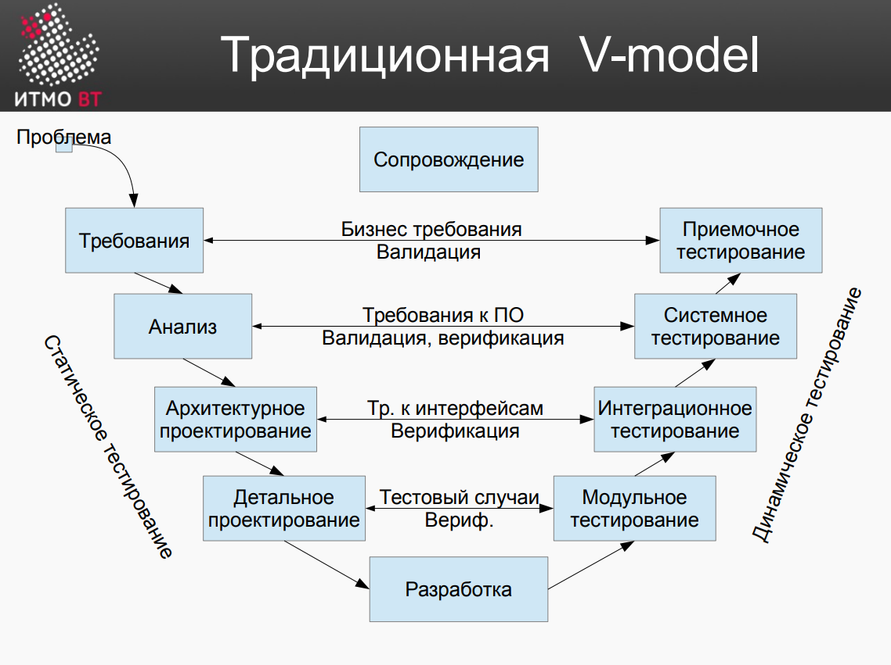

# Термины

+ **Просчет(ошибка)** программиста                                       |   ***Mistake***
+ **Детект(изъян)** в ПО созданный в результате *просчета* программиста  |   ***Fault***
+ **Отказ** или **сбой** как  внешнее проявление *дефекта* в програме    |   ***Failure***
+ В случае *отказа* или *сбоя* невозможно выполнить поставленную задачу, что обычно сопровождается преждевременным завершением работы программы  |   ***Error***

P.s. Всё выше перечисленное неформально можно обозвать **багом** | ***Bug***

+ **Статическое тестирование** (рецензирование) не включает выполнение кода
+ **Динамическое тестирование** - запуск модулей, группп модулей или всей системы...
+ **Валидация** - проверка на соответствие ожиданиям/требованиям пользователя | ***Have we done the right thing?***
+ **Верификация** - проверка качества, технических характеристик, соотвествия спецификациям | ***Have we done the thing right?***

# Восприятие тестирования
+ Уровень 0. **Отладка**
    + Не повторяемая
    + Корректное поведение не отличается от ошибочного (правильность поведения программы должно отпределяться вне её)
    + Не учитывает требования надежности и безопасности (сам пока не понял, что это значит и почему это стоит именно тут - на уровне 0) 
+  Уровень 1. **Демонстрация корректности ПО**
    + Невозможно доказать отсутствие дефектов - только их **наличие**!
    + Тестирование не основывается на формальных правилах
    + Насколько я понимаю, этот уровень заключается в том, что тесты пишутся таким образом, чтобы они проходились. Это создает видимость (ложную) того, что программа работает корректно. Таким образом, цели тестирования, а именно систематическое повышение качества продукта, не достигаются. 
+  Уровень 2. **Поиск ошибок разработчиков тестировщиками**
    + Приводит к конфликту между разработчиками и тестировщиками.
    + Выходит, что тестировщики стремятся найти максимальное кол-во ошибок и перед ними не стоит задачи сделать так, чтобы разрабы начали писать код лучше. Разрабы делат всё так же наполненное ошибками ПО, они не стремятся сделать качественное ПО и не содействуют тестировщикам. Выходит не очень эффективно...
    + [Статейка](https://habr.com/ru/articles/311430/)
+  Уровень 3. **Демонстрация изъянов в ПО**
    + Использование ПО с изъянами (их не может не быть) влечет риски. Если не заниматься их минимизацией - велика вероятность появления различных неприятностей.
    + Для того, чтобы снижать риски более эффективно, разработчики и тестировщики должны совместно работать над этим (бежать в одну сторону).
+  Уровень 4. **Оценка качества ПО и процесса разработки ПО**
    + Если кол-во дефектов увеличивается - значит что-то идёт не так
    + [Доп.презентация](https://myslide.ru/presentation/skachat-osnovy-testirovaniya) Слайды 33-41

# Способы повышения качества ПО
+ **Разработка и использование стандартов**. Если люди пользуются одним и тем же (например апишкой) для реализации какого-то функционала, вероятность дефетов связанных с этим функционалом может уменьшаться.
    + Пример: *использование общего How-To документа в компании, который содержит описание того, как сделать тот или иной элемент*
+ **Обучение**. Если обучать разработчиков новым технологиям, то качества создаваемого ими ПО будет повышаться (чет пока не понятно, очень косвенное повышение получается. Выходит, что повышается квалификация разрабов, но ведь надежность ПО прямо от этого не зависит)
+ **Поиск и Анализ причины дефектов**

# Цели тестирования
+ Обнаружение дефектов
+ Повышение уверенности в качестве ПО. *Другими словами*, повышение **уровня доверия** в том, что ПО **ведет себя корректно** в **требованиях реального окружения**
  + **Уровень доверия** можно повышать показывая пользователю кол-во найденных дефектов, уровень остаточного обнаружения дефектов (снижающийся тренд) или формулируя **требования к надежности** и проверяя их
  + **Корректное поведение** берется из *спецификации*, *требований* или *описания*
  + **Реальное окружение** - реалистичное кол-во данных, сами данные, нагрузка... т.е. те условия, в которых ПО будет использоваться на самом деле. При тестированиии нужно учитывать их и делать тесты таким образом, чтобы они имели смысл в контексте реального использования разрабатываемого ПО
      + **Полное тестовое покрытие** неимеет смысла т.к. чтобы проверить все случаи уйдет неверноятно много времени. Кроме того, все тестовые данные и корректные результаты должны быть созданы заранее, например, если мы проверяем фук-цию умножения, какой-нибудь аналитик-математик должен сесть и просчитать полную таблицу умножения для всего множества значений *Integer*.  
+ Предоставление информации о состоянии продукта
    + в тестировании есть много метрик
    + эта ин-ция может пригодится для принятия решений
+ Предотвращение дефектов

# V-Model
В этой модели всё начинается с написания требований (для статического тестирования), причем для каждого этапа предусмотрен свой этап тестирования (динамического).

# Источники данных для тестов
+ Описание ПО, спецификации, требования, дизайн | **Метод *черного ящика* (не важна внутренняя реализация)**
+ На основе исходного кода | **Метод *белого ящика***
    + Анализ путей (строит граф на основе программы и проверяет ее так, чтобы пройтись по всем веткам)
+ Опыт
+ Модели (хз что это)
  + UML

# Деятельность в тестировании
+ **Проектирование тестов**
    + Тесты нужно проектировать на основании [формальных критериев](https://sovet-kak.ru/a/chto-znachit-formalnye-kriterii-prostymi-i-slozhnymi-slovami-v-internete-ne-nashla-traktovku-etogo-slovosochetaniya#:~:text=%D0%A4%D0%BE%D1%80%D0%BC%D0%B0%D0%BB%D1%8C%D0%BD%D1%8B%D0%B5%20%D0%BA%D1%80%D0%B8%D1%82%D0%B5%D1%80%D0%B8%D0%B8%20%E2%80%93%20%D0%B2%D1%8B%D1%80%D0%B0%D0%B6%D0%B5%D0%BD%D0%B8%D0%B5%2C%20%D0%BA%D0%BE%D1%82%D0%BE%D1%80%D0%BE%D0%B5,%D0%BE%D1%86%D0%B5%D0%BD%D0%BA%D0%B8%2C%20%D0%B8%D0%B7%D0%BC%D0%B5%D1%80%D0%B5%D0%BD%D0%B8%D1%8F%20%D0%B8%D0%BB%D0%B8%20%D1%81%D1%80%D0%B0%D0%B2%D0%BD%D0%B5%D0%BD%D0%B8%D1%8F%20%D1%87%D0%B5%D0%B3%D0%BE%2D%D0%BB%D0%B8%D0%B1%D0%BE), *предметной области, опыта и экспектизы*
+ **Автоматизация тестов**
+ **Исполнение тестов**
    + Ручное тестирование все еще практикуется
        + Пример: Ввели новую функциональность и часть тестов перестала срабатывать. Нужно определить, какие из них не срабатывают в результате просчета, а какие являются артефактами новой функциональности
        + Автоматизация тестов требует времени и иногда она того не стоит
+ **Анализ и интерпретация результатов**
    + На основе *предметной области*

# Цена дефекта
Помимо всего прочего, для исправление дефекта становится дороже со временем, т.к. его фикс необходимо програть по всем стадиям разработки с самого начала. Каждый этап вносит свою стоимость

# Принципы тестирования (ISTQB)
1. Тестирование демонстрирует наличие дефектов
2. Исчерпывающее тестирование недостижимо (полное тестовое покрытие)
3. Раннее тестирование
4. Скопление дефектов (обычно большая часть дефектов группируется в одних модулях)
5. Парадокс пестицида
6. Тестирование зависит от контекста (ретроградный меркурий и солнечные лучи)
7. Заблуждение об отсутствии ошибок.
