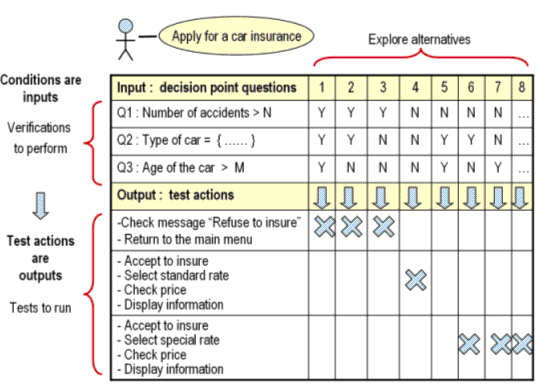

# Тестовый случай и тестовый сценарий
+ **Тестовый *случай*** - одна (*атомарная*) проверка, установка соответствия одного набора входных данных одному набору выходных данных (результатов)
    + Входные данные или управляющее воздействие
    + Условия выполнения (предусловия, постусловия), состояния
    + **Ожидаемый (определён до теста)** результат 
      + Выходные данные
      + Состояния
      + и т.д. 
+ **Тестовый *сценарий*** (test case) - последовательность *тестовых случаев* для проверки цельного пользовательского действия
    + Пользовательский сценарий используются для создания тестовых сценариев 

**Пример** (используется **метод *черного ящика***):

# Корректное поведение
Определено в:
+ Требованиях (системное и приёмочное тестирование)
+ Архитектуре (интеграционное тестирование)
+ Проектной документации (модульное тестирование)

# Выбор тестового покрытия
+ **Эквивалентрое разбиение** (партиции эквивалентности)
    + При варьировании входных данных в неком диапазоне производится аналогичная работа, поэтому нет смысла делать много тестов на этот диапазон
    + Так же используется **анализ граничных значений**
    + 
    + 
+ **Таблица решений** ([статья](https://software-testing.ru/library/testing/functional-testing/129--functional-tester-ibm-rational-))
    + В таблице принятия решений определяется, при каких условиях должно выполняться действие тестирования.
      Каждое условие выражается в виде отношения между переменными, которое должно быть разрешено как истинное или ложное.
      Все возможные комбинации условий определяют набор альтернатив.
      Для каждой альтернативы должно быть рассмотрено действие тестирования.
      Число альтернатив увеличивается экспоненциально вместе с числом условий, что может быть выражено как 2^ЧислоУсловий.
      Когда таблица принятия решений становится слишком сложной, может быть создана иерархия новых таблиц принятия решений.
    + Метод сокращает множество возможных входных данных для проверки. Так например, похожим на предыдущий метод образом,
      при положительном условии № 1 можно относить случай к одной группе эквивалентности.
    + 
+ **Таблица переходов**
    + Каждой **возможной** комбинации состояния и перехода между состояниями сопоставляется соотвествующий тест (если такая комбинация определена, иначе и проверять то нечего)
+ **Сценарии использования** (функциональное тестирование)

# Автоматизация тестирования
+ **Регрессионное тестирование** - автоматически проверяется работоспособность и корректность работы старой функциональности при добавлении новой функциональности или при исправлении дефектов
+ Позволяет повторять тестовые сценарии (в том числе и в разном окружении, например тестировать веб-приложения в разных браузерах)
+ Не избавляет полностью от необходимости в ручном тестировании - автоматизация тестов требует времени и иногда она того не стоит

  
