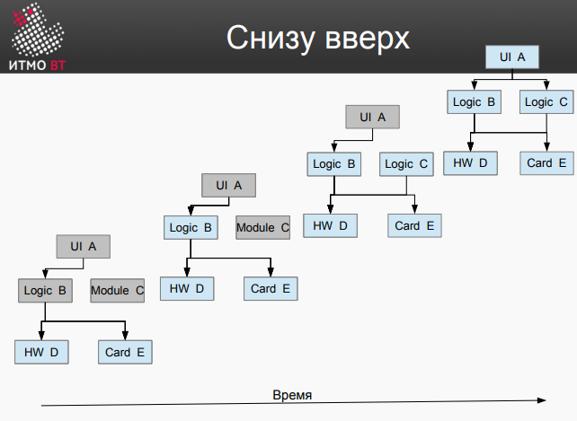
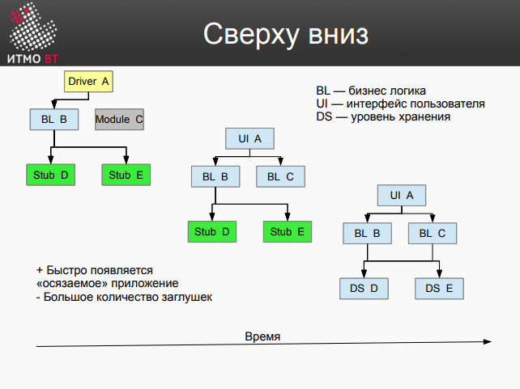

# Модульное тестирование (a.k.a. Юнит тестирование)
\- тестирование отдельных компонентов ПО:
+ **Классов**
+ **Методов**
+ **Программных модулей**, описанных в дизайне


# Изолирование модулей
+ **Драйвер** - система замещающая вызывающий модуль (Например JUnit)
    + Подготавливает окружение и входные данные
    + Дополнительно
      + Запускает серию тестов
      + Настраивает заглушки
      + Формирует журнал результатов 
+ **Заглушка (stub)** - используется вместо вызывающего модуля и эмулирует его поведение и интерфейс 
  

# Анализ результатов теста
Необходимо знать:
+ Входные и выходные данные
+ Значения измененных переменных (состояние)
+ Пройденные пути/принятые решения (алгоритм)
+ Симптомы сбоя

---

# Фреймворк - JUnit 4
[статья 1 (JUnit 4)](https://www.vogella.com/tutorials/JUnit4/article.html),    [статья 2 (JUnit 3 & JUnit 4)](https://habr.com/ru/articles/120101/)
+ Для обозначения методов в качестве тестов использует **аннотации**
+ Для классов, содержащий методы-тесты, принято называть - *ЦельТестирования***Test**
+ Название метода-теста должно отображать, что происходит в тесте (можно использовать *should* или *Given[ExplainYourInput]When[WhatIsDone]Then[ExpectedResult]*)

### Аннотации 
Методы-тесты, которые маркируются аннотациями должны иметь следующие модификаторы: **public [*static*] void**

```
=================================================================================================================================
|  @Test                                |  Маркирует метод как тест                                                             │
├───────────────────────────────────────┼───────────────────────────────────────────────────────────────────────────────────────┤
|  @Before                              |  Исполняется ПЕРЕД КАЖДЫМ тестом,                                                     |
|  *в JUnit 5 - @BeforeEach             |  подготавливает окружение теста (инициализация переменных, объектов, чтение данных)   |
├───────────────────────────────────────┼───────────────────────────────────────────────────────────────────────────────────────┤
|  @After                               |  Исполняется ПОСЛЕ КАЖДЫМ тестом,                                                     |
|  *в JUnit 5 - @AfterEach              |  очищая окружение теста, высвобождает память                                          |
├───────────────────────────────────────┼───────────────────────────────────────────────────────────────────────────────────────┤
|  static @BeforeClass                  |  Исполняется ОДИН РАЗ в САМОМ НАЧАЛЕ тестирования,                                    |
|  *в JUnit 5 - @BeforeAll              |  выполняет времязатратные действия                                                    |
├───────────────────────────────────────┼───────────────────────────────────────────────────────────────────────────────────────┤
|  static @AfterClass                   |  Исполняется ОДИН РАЗ в САМОМ КОНЦЕ ПОСЛЕ тестирования,                               |
|  *в JUnit 5 - @AfterAll               |  производит очищение                                                                  |
├───────────────────────────────────────┼───────────────────────────────────────────────────────────────────────────────────────┤
|  @Ignore или @Ignore("Why disabled")  |  Отключает тест, например, если тестируемый функционал был отредактирован,            |
|  *в JUnit 5 - @Disabled               |  а тест еще не адаптирован под изменения                                              |
├───────────────────────────────────────┼───────────────────────────────────────────────────────────────────────────────────────┤
|  @Test (expected = Exception.class)   |  Завершается ошибкой, если метод НЕ генерирует заданное исключение                    |
├───────────────────────────────────────┼───────────────────────────────────────────────────────────────────────────────────────┤
|  @Test(timeout=100)                   |  Завершается неудачей, если выполнение метода занимает более 100 миллисекунд          |
=================================================================================================================================
```

### Методы сравнения (assertions)
[статья (JUnit 4 и JUnit 5)](https://www.baeldung.com/junit-assertions)

*В методах в качестве первого параметра (в JUnit 5 **message** - последний параметр ) дополнительно можно(нужно) указать **СООБЩЕНИЕ**, которое будет выводится при неудачном завершении теста.*

**!!!** Для сравнения ***float*** или ***double*** необходимо указывать ***delta*** - максимальная разница между значениями, при которой оба числа по-прежнему считаются равными.
```
================================================================================================================================
|  fail ()                                        | Заваливает тест.                                                           |
|                                                 | Для проверки, что определенное место в коде теста не достижимо             |
├─────────────────────────────────────────────────┼────────────────────────────────────────────────────────────────────────────┤
|  assertTrue (boolean condition)                 |  Проверяет, что условие ИСТИННО                                            |
|  assertFalse (boolean condition)                |  Проверяет, что условие ЛОЖНО                                              |
├─────────────────────────────────────────────────┼────────────────────────────────────────────────────────────────────────────┤
|  assertEquals (T expected, T actual)            |  Проверяет равенство значений                                              |
|  assertNotEquals (T expected, T actual)         |  Проверяет неравенство значений                                            |
├─────────────────────────────────────────────────┼────────────────────────────────────────────────────────────────────────────┤
|  assertNull (Object object)                     |  Проверяет, что объект равен null                                          |
|  assertNotNull (Object object)                  |  Проверяет, что объект НЕ равен null                                       |
├─────────────────────────────────────────────────┼────────────────────────────────────────────────────────────────────────────┤
|  assertSame (Object expected, Object actual)    |  Проверяет, что два объекта ссылаются на один и тот же объект              |
|  assertNotSame (Object expected, Object actual) |  Проверяет, что два объекта ссылаются на один и тот же объект              |
├─────────────────────────────────────────────────┼────────────────────────────────────────────────────────────────────────────┤
|  assertArrayEquals (T[] expecteds, T[] actuals) |  Проверяет, что два массива объектов или примитивов равны по содержанию    |
├─────────────────────────────────────────────────┼────────────────────────────────────────────────────────────────────────────┤
|  assertThrows (Class<T> expectedThrowable, ThrowingRunnable runnable)                                                        |
|  Проверяет, что runnable выдает исключение типа expectedThrowable при выполнении                                             |  
================================================================================================================================
```

### Не расмотрено
+ Suite
+ Rules
+ RunWith (Запускалки - Drivers)

---


# Фреймворк - Mockito
[статья 1](https://habr.com/ru/articles/444982/), [статья 2](https://www.vogella.com/tutorials/Mockito/article.html)

**Mokito** - фрейворк для упрощения тестирования (result testing & behavior testing) программных компонентов с внешними [зависимостями](https://habr.com/ru/articles/349836/)

1. Создание **mock** класса *DataService*:
    ```
        DataService dataServiceMock = Mockito.mock(DataService.class);
    ```
   Для созданного объекта
    + instanceof DataService вернёт true
    + dataServiceMock.getClass() — DataService.class
    + Для такого **mock** сразу после создания характерно некое поведение по умолчанию - все методы обычно возвращают:
        + **null** - для ссылочных(объетных) типов
        + **0** - для числовых примитивных типов
        + **false** - для boolean
        + **Пустую коллекцию** - если возвращаемый тип - коллекция 

    Альтернативный способ через аннотации:
    ```
        // demonstrates the return of multiple values
        @ExtendWith(MockitoExtension.class)
        class ServiceDatabaseIdTest {

            @Mock
            Database databaseMock;
        }
    ```

    Аннотация **@Mock** может так же использоваться для параметров методов:
    ```
        // this test demonstrates how to return values based on the input
        // and that @Mock can also be used for a method parameter
        @Test
        void testReturnValueDependentOnMethodParameter(@Mock Comparable<String> c)  {
                when(c.compareTo("Mockito")).thenReturn(1);
                when(c.compareTo("Eclipse")).thenReturn(2);
                //assert
                assertEquals(1, c.compareTo("Mockito"));
                assertEquals(2, c.compareTo("Eclipse"));
        }
    ```
    
3. Управление поведением
    ```
        List<String> data = new ArrayList<>();
        data.add("dataItem");
        Mockito.when(dataService.getAllData()).thenReturn(data);
    ```
    После этой операции, вызвав у объекта *dataService* метод *getAllData()*, получу объект, заданный в первой строчке листинга - *data*. Для одного и того же метода можно задать поведение несколько раз с разными требованиями к аргументам, и все определённые таким образом модели поведения будут действовать одновременно. При пересечении приоритет у того определения, что было задано позже.

    + Если нужно задать реакцию на любой вызов этого метода независимо от аргументов, нужно воспользоваться методом ***Mockito.any()*** (***anyString()***, ***anyInt()***):
        ```
            Mockito.when(dataService.getDataItemById(any())).thenReturn("dataItem");   
        ```

    + Если требуется, чтобы ***mock*** реагировал только на определённое значение аргумента, можно использовать непосредственно это значение или методы ***Mockito.eq()*** (когда речь об эквивалентности) либо ***Mockito.same()*** (когда требуется сравнение ссылок):
        ```
            Mockito.when(dataService.getDataItemById("idValue")).thenReturn("dataItem");
            // or
            Mockito.when(dataService.getDataItemById(Mockito.eq("idValue"))).thenReturn("dataItem");
        ```

   + А если нужно, чтобы аргумент отвечал каким-то требованиям, для этого есть ряд удобных специализированных статических методов того же класса ***Mockito*** (например, строки можно проверить на содержание в начале или в конце определённой последовательности символов, соответствие паттерну и др.). Также имеется общий метод ***Mockito.argThat()*** (и его аналоги для примитивных типов), принимающий реализацию функционального интерфейса ***ArgumentMatcher***:
        ```
            Mockito.when(dataService.getDataById(
                Mockito.argThat(arg -> arg == null || arg.length() > 5)))
           .thenReturn("dataItem");
        ```
4. Задание результатов вызова
Если указывается более одного возвращаемого значения, они возвращаются в порядке указания, пока не будет использовано последнее.
После этого возвращается последнее указанное значение.
    ```
    @Test
        void testMoreThanOneReturnValue() {
            when(i.next()).thenReturn("Mockito").thenReturn("rocks");
            String result = i.next() + " " + i.next();
            // assert
            assertEquals("Mockito rocks", result);
        }
    ```
    + **.thenReturn(object);** - в случе, если нужно вернуть примитивный тип, будет происходить *un/boxing*
    + **.thenThrow(new IllegalArgumentException());**
        ```
            // demonstrates the configuration of a throws with Mockito
            // not a read test, just "testing" Mockito behavior
            @Test
            void testMockitoThrows() {
                Properties properties = Mockito.mock(Properties.class);

                when(properties.get(Mockito.anyString())).thenThrow(new IllegalArgumentException("Stuff"));

                Throwable exception = assertThrows(IllegalArgumentException.class, () -> properties.get("A"));

                assertEquals("Stuff", exception.getMessage());
            }
        ```
    + **.thenThrow(IllegalArgumentException.class);**
    + **.thenAnswer** (пока не рассматривал)
   

---


# Интеграционное тестирование
\- тестирование взаимодействия модулей и программных  интерфейсов

## Интеграция модулей:
+ Т.к. для начала интеграции требуется как минимум 2 модуля, имеет смысл начинать разработку с двух связанных модулей, чтобы тестирование и разработка шли параллельно - для этого существуют **стратегии интеграции**. (**Стратегию интеграции** необходимо согласовывать со **стратегией разработки**) Так же **порядок интеграции** имеет значение. Необходимо выбирать тестируемые модули, чтобы сам процесс тестирования был легче.
+ Чем больше **степень интеграции**, тем сложнее проводить интеграционное тестирование.
    + В случае, если мы говорим большом количестве модулей в общем, то большая степень интеграции соответствует большему множеству этапов интеграции, а каждый этап - отдельной сборке взаимодействующих модулей и заглушек, от которых они зависят. Каждая сборка нуждается в тестировании. Кроме того, это усложняет сам процесс сборки.
    + В случае, если мы говорим о большом количестве модулей взаимодействующих в конкретном тесте, то с увеличением их количества растет и вероятность проявления дефекта - это усложняет процесс его поиска. Каждый интерфейс нужно протестировать.

## Cтратегии интеграции:
+ `Сверху вниз`
    + Создаем систему из **заглушек** и постепенно заменяем из **реальными модулями**
    + Сразу имеем «осязаемое» приложение
    + Т.к. интеграция начинается с верхних модулей (которые зависят от еще не созданных модуей) придется делать много **заглушек**
+ `Снизу вверх`
+ `Функциональная` aka "end to end"
    + Делаем все для работы одной функции (для одного пользовательского сценария) (UI, логика, DB) и добавляем ее
    + Делаем то же самое для следующего сценария
+ `Ядро` aka "backbone"
    + В первую очередь собираем каркас (ядро)
    + Затем добавляем детали
    + Чем-то похоже на стратегию `Сверху вниз`, но там нет деления модулей по из функциональной значимости, только по их зависимости от других модулей  
+ `Большой взрыв` aka "big bang"



